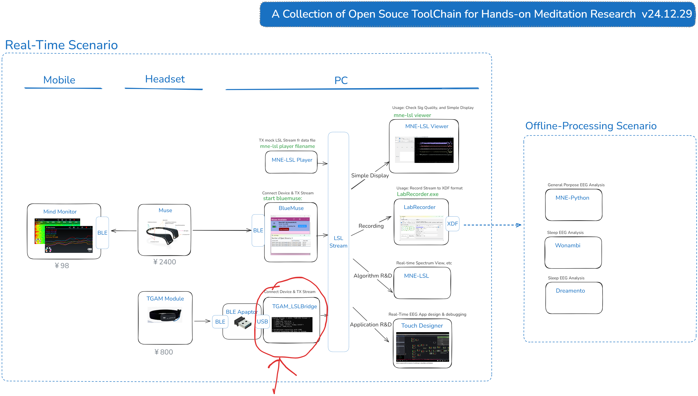

This Repository currently has only one tool contained.

# 1.TGAM-LSL Bridge
a bridge to forward NeuroSky [TGAM](https://store.neurosky.com/products/eeg-tgam) data from BLE-USB Adaptor to LSL Stream
so data can be process with Open Source tools.

The positioning of TGAM-LSL Brdige in my toolchain is shown below

