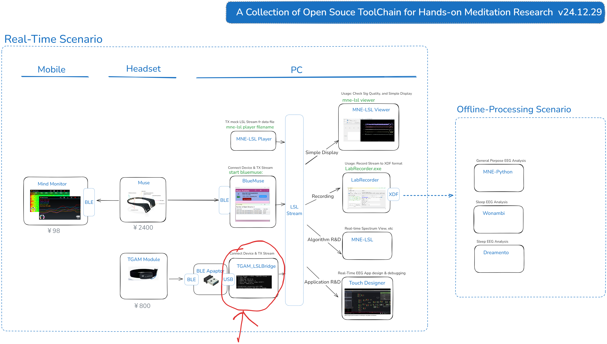

# What is TGAM-LSL-Bridge
In short, this tool transfers TGMA data into LSL Stream, so data can be processed by open source NeurScience tools that supports LSL.

Verbosely speaking, it is a bridge that sends [LSL](https://labstreaminglayer.org/) Stream data, which is forwarded from BLE-USB adaptor, which forwards EEG data from NeuroSky [TGAM](https://store.neurosky.com/products/eeg-tgam) device.


The positioning of TGAM-LSL-Bridge in toolchain/topology used by me personally, is shown below:



# How to Run
* turn on TGAM head band
* makde sure that your COM port specificied in NeuroSkyTGAM-LSL-Bridge.py, is identical to the one shown on PC
* run following command in src forder:

>python ./NeuroSkyTGAM-LSL-Bridge.py

Then you should be able to see output like this:
```
Started Stream: < sInfo 'TGAM EEG Stream' >
  | Type: EEG
  | Sampling: 512.0 Hz
  | Number of channels: 1
  | Data type: <class 'numpy.int16'>
  | Source: TGAM-LSL-Bridge

* Established connection with COM5
* Started Forwarding COM data to Stream...
```
* then run following command, will see the output of Stream

> mne-lsl viewer


